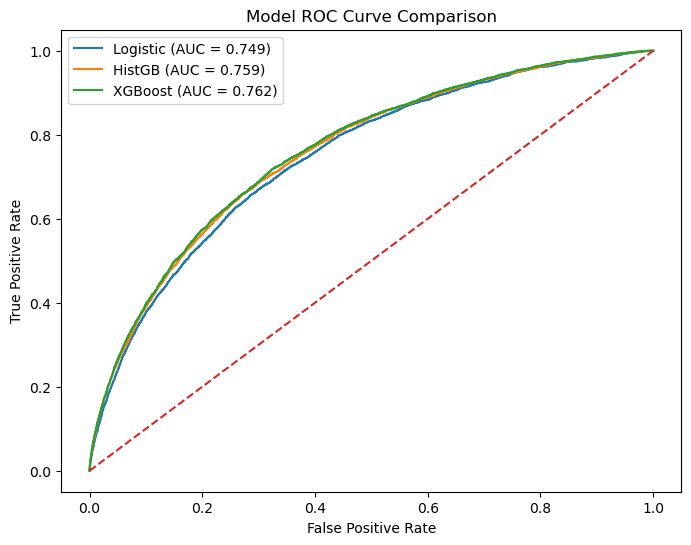
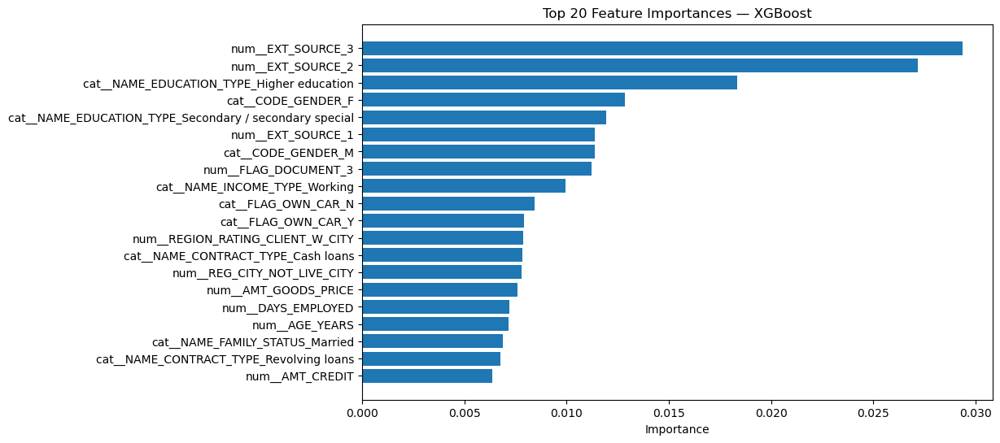
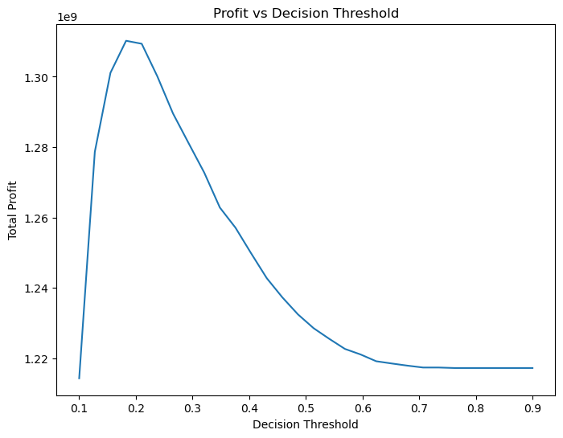

# Credit Risk Prediction — ML System

##  Project Overview

This project implements an end-to-end machine learning system for predicting loan default risk using real-world financial application data.

The system is designed with **production ML engineering principles**, including:

* Modular feature engineering pipelines
* Reusable preprocessing and model training modules
* Multi-model benchmarking
* Cross-validation based performance validation
* Business-aware decision optimization using profit simulation
* Model interpretability via feature importance analysis
* Inference-ready model serialization

This project emphasizes **real-world ML workflow**, not just model accuracy.

---

##  Business Problem

Financial institutions must estimate the probability that a customer will default on a loan.

Accurate credit risk prediction enables:

* Risk-adjusted loan approvals
* Portfolio loss reduction
* Interest rate optimization
* Regulatory-compliant risk modeling

###  Objective

Predict probability of default (PD) for each applicant and optimize approval threshold for maximum portfolio profit.

---

##  Dataset

Dataset: Home Credit Default Risk
Primary Table Used: `application_train.csv`

Future extensions could include:

* Credit bureau history
* Previous loan performance
* Installment payment behavior

---

##  System Architecture

```
Raw Data
↓
Feature Engineering (src/features)
↓
Preprocessing Pipeline (ColumnTransformer)
↓
Model Training Modules (src/models)
↓
Cross Validation Evaluation
↓
Model Comparison & Selection
↓
Business Decision Optimization (Profit Simulation)
↓
Model Serialization (Deployment Ready)
```

---

##  Repository Structure

```
src/
 ├ features/
 │   ├ build_features.py
 │   ├ pipeline.py
 │
 ├ models/
 │   ├ train_model.py
 │   ├ train_tree_model.py
 │   ├ train_histgb_model.py
 │   ├ train_xgb_model.py
 │   ├ evaluate_model.py
 │   ├ save_model.py
 │
 ├ decision/
 │   ├ profit_simulation.py
 │
notebooks/
 ├ 01_eda.ipynb
 ├ 03_modeling.ipynb

artifacts/
 ├ xgb_credit_model.joblib
```

---

##  Feature Engineering Strategy

### Financial Stress Features

* Credit-to-Income Ratio
* Annuity-to-Income Ratio

### Customer Stability Signals

* Employment anomaly detection
* Registration duration
* Phone activity recency

### Demographic Features

* Age conversion from raw birth date encoding

### Data Quality Handling

* Sentinel missing value handling
* Identifier column removal
* Redundant feature removal

---

##  Preprocessing Pipeline

Implemented using sklearn `ColumnTransformer`.

### Numeric Pipeline

* Median Imputation
* Standard Scaling

### Categorical Pipeline

* Most Frequent Imputation
* One-Hot Encoding with unknown category safety

---

##  Models Evaluated

| Model                | Purpose                      |
| -------------------- | ---------------------------- |
| Logistic Regression  | Linear baseline              |
| Random Forest        | Nonlinear bagging baseline   |
| Gradient Boosting    | Sequential boosting baseline |
| HistGradientBoosting | Modern histogram boosting    |
| XGBoost              | Final production candidate   |

---

##  Model Performance

### Validation ROC AUC

| Model                | ROC AUC    |
| -------------------- | ---------- |
| Logistic Regression  | ~0.749     |
| Random Forest        | ~0.726     |
| Gradient Boosting    | ~0.753     |
| HistGradientBoosting | ~0.759     |
| XGBoost              | **~0.762** |

---

###  ROC Curve Comparison



---

##  Cross Validation Stability

Logistic Baseline Cross Validation:

* Mean ROC AUC: ~0.746
* Std Dev: ~0.0026

Indicates stable model generalization.

---

##  Final Model Selection

###  Selected Model: XGBoost

Selected because:

* Highest validation ROC AUC
* Strong tabular feature interaction modeling
* Industry standard for structured financial ML
* Stable training behavior

---

##  Model Interpretability

Feature importance analysis confirms dominant signals from:

* External credit risk score features (EXT_SOURCE variables)
* Financial stress ratio features
* Customer stability indicators
* Age / lifecycle features

---

###  Feature Importance Visualization



---

##  Business Decision Optimization (Profit Simulation)

Instead of using default probability threshold (0.5), a profit simulation layer was implemented to optimize loan approval decisions.

### Simulation Includes:

* Interest revenue modeling
* Loss given default modeling
* Operational cost modeling

---

### Key Finding

Optimal Approval Threshold ≈ **0.20**

This reflects real-world credit risk asymmetry:
Default losses are much larger than interest gains.

---

###  Profit vs Threshold Visualization



---

##  Deployment Readiness

Final model is saved as serialized pipeline artifact:

```
artifacts/xgb_credit_model.joblib
```

This includes:
Feature Engineering
Preprocessing
Model Inference

---

## ▶ How To Run

### Install Dependencies

```
pip install -r requirements.txt
```

---

### Train Models

Run:

```
notebooks/03_modeling.ipynb
```

---

### Load Model For Inference

```python
import joblib

model = joblib.load("artifacts/xgb_credit_model.joblib")
preds = model.predict_proba(X_new)
```

---

##  Key Technical Learnings

* Feature engineering dominates tabular ML performance
* Boosting models outperform bagging on structured financial data
* Histogram boosting improves training efficiency significantly
* Cross-validation is critical for stable evaluation
* Business-aligned metrics outperform pure accuracy metrics

---

##  Future Improvements

Potential next enhancements:

* Multi-table feature aggregation
* Probability calibration for financial risk pricing
* Model monitoring and drift detection
* Real-time inference pipeline

---

##  Author

Built as a production-style machine learning system demonstrating:

* End-to-end ML pipeline engineering
* Financial tabular modeling best practices
* Business-aligned ML decision making


